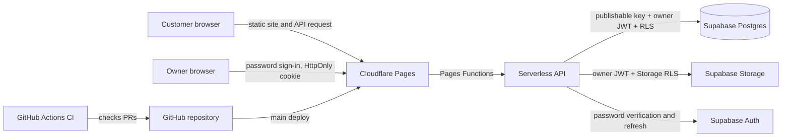

# Cottage 44 architecture proposal

Status: owner workflow implemented; Supabase account setup and hosting remain manual

## Existing repository and deployment

- The public menu and the `/admin/` owner page are plain HTML, CSS, and
  JavaScript under `docs/`.
- Menu data is in `docs/menu.js`. The public page also reads only today's
  plate from the Pages API.
- Cloudflare Pages Functions provide the public daily-plate API and secured
  owner-management endpoints.
- GitHub Pages currently publishes `main`/`docs` at
  `https://menu.cottage44.co.za/`, with HTTPS enforced.
- GitHub's Pages usage policy says Pages must not be used for a site primarily
  intended to facilitate commercial transactions. Since this is a restaurant
  website, the proposed production host is Cloudflare Pages. The Pages project
  has not been configured or deployed.

## Proposed architecture



### Frontend

Keep the existing menu and its design. Public pages remain static and do not
require a custom server to be running. The API is a Pages Function, not a
browser Supabase client or a separate frontend application.

The public page requests `/api/plates/today` from the same origin and renders
the plate's name, description, Johannesburg service date, price, and optional
photo. Loading, no-plate, invalid-response, and request-failure states are
handled without exposing server errors; an unavailable image is replaced with
a text fallback. Tests use mocked API responses and do not require Supabase.
For a live preview, Cloudflare Pages must build this feature branch with Pages
Functions enabled, the required Supabase bindings configured, and the plate
migration applied. Verify the preview's `/api/plates/today` route returns
`application/json` with `{ "plate": null }` or a valid current-date plate.
A preview served from an older static-only deployment can return an HTML
fallback for the API path, in which case the page will intentionally show its
safe unavailable message rather than a plate.

### Backend, authentication, and authorization

Use Cloudflare Pages Functions as a serverless API layer in front of Supabase
Postgres. The public API exposes `GET /api/health` and
`GET /api/plates/today`; the latter queries the service date in the
`Africa/Johannesburg` timezone and returns `{ "plate": null }` if none is
assigned. A populated response contains only the plate ID, service date, name,
description, price in cents, and optional HTTPS image URL. Owner routes under
`/api/admin/` provide sign-in, plate create/update/delete, image upload,
history, and today's assignment. They return no database errors, internal
columns, stack traces, or credentials. The browser does not access Supabase
directly.

The Functions use the project URL and a Supabase publishable key from runtime
bindings. The public API exposes only the current South African service date
and the plate fields needed by the menu; it does not expose the catalog or
history. The public site remains usable if the API is unavailable.

`/admin/` uses Supabase Auth email/password verification through the server.
The access and refresh tokens are held only in a `Secure` (on HTTPS),
`HttpOnly`, `SameSite=Strict`, `/api/admin` cookie; the admin JavaScript never
reads or stores them. Mutations require the exact request `Origin` and an
authenticated owner session. A checked **Remember me** choice (default) gives
the cookie a 30-day lifetime; unchecked sessions use a browser-session cookie
without a persistent expiry.
Supabase refresh responses preserve the selected duration.

The server accepts only `corne.dawson@gmail.com`, verified against the
Supabase Auth user email on sign-in and on every request. It does not trust
user-editable metadata. PostgreSQL and Storage RLS independently compare the
verified JWT `email` claim with that owner address for every admin operation.
No service-role key is used or required. Supabase public sign-up must be
disabled manually, and the owner Auth user must be created manually; see the
setup steps below.

### Data and images

Use migrations for the schema. The initial migration creates `plates` and
`daily_plates`, with field constraints, timestamps, a foreign key, an index,
and a primary key ensuring only one plate per service date. Its public RLS
policies allow `anon` to select only the current South African service date
and the referenced plate. It grants no insert, update, or delete permissions.
The owner migration grants authenticated catalog/history access and owner-only
plate and daily-assignment mutations. The history endpoint returns at most the
most recent 365 daily assignments; saved catalog plates remain reusable.

Store images in the `cottage44-plates` Supabase Storage bucket, never in Git.
The bucket is public-read because plate photos are intended for the public
menu; insert/update/delete are restricted by Storage RLS to the owner email.
Uploads accept JPEG, PNG, and WebP only, are limited to 5 MiB, and are checked
against the file signature. Object names are server-generated UUIDs with an
extension derived from the accepted MIME type; original filenames are ignored.
Admin writes only accept public URLs from this bucket.

### Hosting and branch flow

- **Production frontend:** Cloudflare Pages, custom domain
  `menu.cottage44.co.za`, production branch `main`.
- **API:** Cloudflare Pages Functions under `functions/api/`, using the
  Supabase URL and publishable key as runtime bindings.
- **Integration:** feature branches merge through pull requests into `dev`.
  Cloudflare Pages can provide preview deployments for development branches
  and pull requests.
- **Production release:** promote reviewed, CI-passing changes from `dev` to
  `main`; only `main` deploys to the production site.

Cloudflare Pages setup and DNS changes are outside this implementation.

## CI/CD and repository rules

Use GitHub Actions for pull-request checks and branch pushes. The intended gate
is dependency installation, lint, type checking, unit/integration tests, and a
production build; add end-to-end checks as the app gains those workflows. Checks
should run for PRs into both `dev` and `main`, and for pushes to both branches.
The exact check names should be made required only after the workflow has run
successfully at least once. The initial workflow now provides `checks`,
and this check is configured as required on both protected branches.

Protect both `dev` and `main`: require pull requests and successful required CI
checks, do not require a separate approval (the owner chose a solo-friendly
gate), disallow force pushes and branch deletion, and enforce the rules for
administrators. Do not merge a failing or unchecked change. Production
deployment should run only after a validated update reaches `main`.

The PR, administrator-enforcement, conversation-resolution, force-push, and
deletion protections have been enabled on both branches. The required status context is `checks`, with strict up-to-date checks enabled.

## Environment and secrets

The public Supabase URL and publishable/anon key are identifiers intended for
browser use, not secrets; they are safe only when RLS is correctly configured.
`SUPABASE_URL` and `SUPABASE_PUBLISHABLE_KEY` are the only runtime bindings
used by these Functions. Configure both under Cloudflare Pages **Preview** and
**Production** environments with the same binding names. They identify the
project and are not service credentials; RLS is the security boundary. Do not
add a service-role key, database password, JWT signing secret, or deployment
token to the app. Keep any unrelated deployment credentials out of the
repository and public build output.

## Cost and operational limits

The target is **R0/month**. Cloudflare Pages and Supabase Free are the selected
tiers; Pages Functions use Cloudflare Workers quotas, which should be checked
against current limits before launch. Supabase Free currently lists 50,000
monthly active users, 500 MB database, 5 GB egress, 5 GB cached egress, and 1
GB file storage. Free projects may be paused after one week of inactivity and
the free plan is limited to two active projects.

Expected usage is one small restaurant menu, one current plate image, and
occasional owner updates; compress images and monitor usage to keep within the
free limits. Exceeding free quotas may require reducing usage or deliberately
upgrading a plan. Do not add a payment method, enable paid features, or upgrade
without the owner's explicit approval. Plan limits and terms can change, so
verify them during account setup. Free-tier pauses and lack of paid-tier
backups are operational trade-offs; establish an export/recovery procedure
before relying on production data.

References checked 7 October 2026:

- [Supabase pricing and free-plan limits](https://supabase.com/pricing)
- [Cloudflare Workers and Pages pricing](https://developers.cloudflare.com/workers/platform/pricing/)
- [GitHub Pages limits and usage policy](https://docs.github.com/en/pages/getting-started-with-github-pages/github-pages-limits)

## Local setup and manual account steps

1. In the intended Supabase project, disable public user registration in
   **Authentication → Settings → User Signups** (“Allow new users to sign up”).
   Keep sign-in enabled.
2. Create the owner in **Authentication → Users → Add user** with the exact
   email `corne.dawson@gmail.com` and a strong, unique password. Confirm the
   email in the dashboard if the project requires confirmation. Do not grant
   access through user-editable metadata. Password resets are managed through
   Supabase Auth.
3. Review and apply, in order, the migrations
   `20261007100000_create_plates_and_daily_plates.sql` and
   `20261007110000_add_owner_admin_and_plate_images.sql` to the intended
   project using its SQL editor. The latter creates the bucket and owner-only
   database/Storage policies. It has not been applied remotely by this work.
4. For local development, run `npm ci`, copy `.env.example` to `.dev.vars`,
   and replace placeholders locally (do not commit the file):

   ```dotenv
   SUPABASE_URL=https://your-project-ref.supabase.co
   SUPABASE_PUBLISHABLE_KEY=sb_publishable_replace_with_project_key
   ```

   Start local Pages with `npm run dev`; `.dev.vars` is Git-ignored. Use only
   the URL and publishable key—never put a service-role key in `.dev.vars`.
5. In Cloudflare Pages **Settings → Variables and Secrets**, add
   `SUPABASE_URL` and `SUPABASE_PUBLISHABLE_KEY` separately to both the
   **Preview** and **Production** environments, using the values from the
   intended Supabase project. The variable names are identical in both
   environments. Do not add service-role credentials.
6. Deploy the reviewed branch to Cloudflare Pages before using `/admin/`.
   GitHub Pages can render the static files but does not run these API
   Functions. This work has not created a Pages project, deployed, or changed
   DNS. The runtime configuration values have not been supplied or written
   into this repository.
