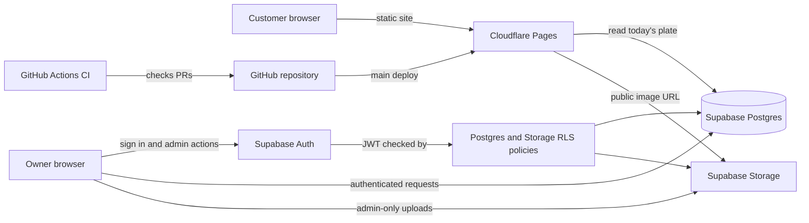

# Cottage 44 architecture proposal

Status: proposed foundation for review

## Existing repository and deployment

- The public menu is plain HTML, CSS, and JavaScript under `docs/`; there is no
  application framework, package manager, backend, or build step.
- Menu data is in `docs/menu.js`. The page already supports responsive layouts
  and a persisted light/dark theme.
- The repository has no existing automated test or GitHub Actions configuration.
- GitHub Pages currently publishes `main`/`docs` at
  `https://menu.cottage44.co.za/`, with HTTPS enforced.
- `main` and `dev` currently point to the same commit. Neither branch currently
  has protection rules configured.
- GitHub's Pages usage policy says Pages must not be used for a site primarily
  intended to facilitate commercial transactions. Since this is a restaurant
  website, the proposed production host is Cloudflare Pages; the existing
  GitHub Pages deployment should be treated as temporary during migration.

## Proposed architecture

### Frontend

Keep the existing menu and its design. For the dynamic admin area, use a small
TypeScript/Vite build only if it is needed to bundle Supabase's client library
and keep configuration explicit; do not introduce a larger UI framework without
a demonstrated need. Public pages remain static and do not require a custom
server to be running.

### Backend, authentication, and authorization

Use Supabase Postgres and Supabase Auth. The browser may use the public Supabase
URL and publishable/anon key, but database row-level security (RLS) and Storage
policies must enforce access on the service side. Disable public sign-up and
grant the owner an admin role that cannot be changed through user-editable
metadata. Never put a Supabase service-role key or database password in browser
code or a public build.

Keep backend logic small. Use database policies for access boundaries and add a
server-side function only if a later requirement cannot safely be implemented
with Supabase Auth, RLS, and Storage policies.

### Data and images

Use migrations for the schema. A `plates` table holds plate details and saved
state; a `daily_plates` table relates a plate to a service date, with a unique
constraint on that date and a foreign key to the plate. Public reads should
expose only the current day's plate; authenticated admin reads can access
history. Use constraints and validation for dates, names, IDs, and deletion
behaviour.

Store images in Supabase Storage, never in Git. A public-read bucket is
appropriate for restaurant plate photos, while upload/update/delete operations
must be restricted by Storage RLS to the admin. Generate object paths from
server-side-safe identifiers rather than trusting uploaded filenames, and set
strict image type and size limits.

### Hosting and branch flow

- **Production frontend:** Cloudflare Pages, custom domain
  `menu.cottage44.co.za`, production branch `main`.
- **Integration:** feature branches merge through pull requests into `dev`.
  Cloudflare Pages can provide preview deployments for development branches
  and pull requests.
- **Production release:** promote reviewed, CI-passing changes from `dev` to
  `main`; only `main` deploys to the production site.
- **DNS cutover:** keep the current site intact until a Cloudflare Pages build
  is verified. Changing DNS or transferring nameservers requires the owner;
  no live DNS settings should be changed as part of this proposal.

## CI/CD and repository rules

Use GitHub Actions for pull-request checks and branch pushes. The intended gate
is dependency installation, lint, type checking, unit/integration tests, and a
production build; add end-to-end checks as the app gains those workflows. Checks
should run for PRs into both `dev` and `main`, and for pushes to both branches.
The exact check names should be made required only after the workflow has run
successfully at least once. The initial workflow now provides `checks`,
and this check is configured as required on both protected branches.

Protect both `dev` and `main`: require pull requests and successful required CI
checks, do not require a separate approval (the owner chose a solo-friendly
gate), disallow force pushes and branch deletion, and enforce the rules for
administrators. Do not merge a failing or unchecked change. Production
deployment should run only after a validated update reaches `main`.

The PR, administrator-enforcement, conversation-resolution, force-push, and
deletion protections have been enabled on both branches. The required status context is `checks`, with strict up-to-date checks enabled.

## Environment and secrets

The public Supabase URL and publishable/anon key are identifiers intended for
browser use, not secrets; they are safe only when RLS is correctly configured.
Keep server-only credentials (including service-role keys, database passwords,
and deployment tokens) out of the repository, logs, and public build output.
Store any required deployment credentials in GitHub Actions secrets or the
hosting provider's encrypted settings. Do not create credentials or configure
production environments without the owner's account.

## Cost and operational limits

The target is **R0/month**. Cloudflare Pages static assets are free and
unlimited under the documented Workers Free plan; avoid Workers/Pages Functions
unless a requirement justifies them. Supabase Free is $0/month and currently
lists 50,000 monthly active users, 500 MB database, 5 GB egress, 5 GB cached
egress, and 1 GB file storage. Free projects may be paused after one week of
inactivity and the free plan is limited to two active projects.

Expected usage is one small restaurant menu, one current plate image, and
occasional owner updates; compress images and monitor usage to keep within the
free limits. Exceeding free quotas may require reducing usage or deliberately
upgrading a plan. Do not add a payment method, enable paid features, or upgrade
without the owner's explicit approval. Plan limits and terms can change, so
verify them during account setup. Free-tier pauses and lack of paid-tier
backups are operational trade-offs; establish an export/recovery procedure
before relying on production data.

References checked 7 October 2026:

- [Supabase pricing and free-plan limits](https://supabase.com/pricing)
- [Cloudflare Workers and Pages pricing](https://developers.cloudflare.com/workers/platform/pricing/)
- [GitHub Pages limits and usage policy](https://docs.github.com/en/pages/getting-started-with-github-pages/github-pages-limits)

## Accounts and owner setup still required

1. Create or confirm a Cloudflare account and add the Cottage 44 domain. The
   owner must retain registrar/DNS access for the later production cutover.
2. Create a Supabase account and project. Select a suitable nearby region, then
   provide the project URL and publishable/anon key through a secure channel;
   never send or commit the service-role key.
3. Confirm the owner email to invite as the sole admin. Disable public
   registration and assign the server-managed admin role during setup.
4. After the implementation is ready, configure Cloudflare Pages' GitHub
   connection and the production custom domain. No credentials or account
   configuration can be guessed or safely completed without these accounts.

This proposal does not authorize a production DNS change, paid-plan upgrade, or
application implementation. Those remain gated on service setup and review.
