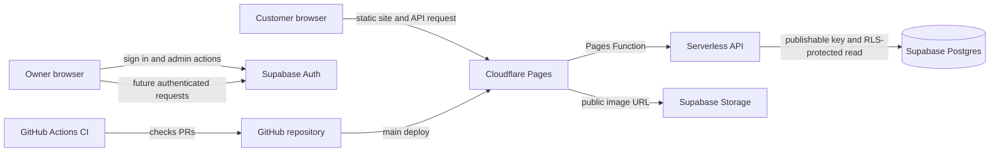

# Cottage 44 architecture proposal

Status: backend foundation implemented; service and hosting setup remain manual

## Existing repository and deployment

- The public menu remains plain HTML, CSS, and JavaScript under `docs/`.
- Menu data is in `docs/menu.js`. The page already supports responsive layouts
  and a persisted light/dark theme.
- Cloudflare Pages Functions now provide the first server-side API slice;
  the static menu is unchanged.
- GitHub Pages currently publishes `main`/`docs` at
  `https://menu.cottage44.co.za/`, with HTTPS enforced.
- GitHub's Pages usage policy says Pages must not be used for a site primarily
  intended to facilitate commercial transactions. Since this is a restaurant
  website, the proposed production host is Cloudflare Pages. The Pages project
  has not been configured or deployed.

## Proposed architecture

### Frontend

Keep the existing menu and its design. Public pages remain static and do not
require a custom server to be running. The API is a Pages Function, not a
browser Supabase client or a separate frontend application.

### Backend, authentication, and authorization

Use Cloudflare Pages Functions as a serverless API layer in front of Supabase
Postgres. The initial API exposes `GET /api/health` and
`GET /api/plates/today`; the latter queries the service date in the
`Africa/Johannesburg` timezone and returns `{ "plate": null }` if none is
assigned. A populated response contains only the plate ID, service date, name,
description, price in cents, and optional HTTPS image URL. It does not return
database errors, internal columns, stack traces, or credentials. The browser
does not access Supabase directly.

The Function uses the project URL and a Supabase publishable key from Cloudflare
bindings. Database row-level security (RLS) further limits the `anon` role to
reading today's plate; the migration grants no public writes. Do not use a
service-role key for this public read. Authentication, admin access, uploads,
and writes are explicitly deferred. When those are designed, disable public
sign-up and grant the owner an admin role that cannot be changed through
user-editable metadata.

### Data and images

Use migrations for the schema. The initial migration creates `plates` and
`daily_plates`, with field constraints, timestamps, a foreign key, an index,
and a primary key ensuring only one plate per service date. Its public RLS
policies allow `anon` to select only the current South African service date
and the referenced plate. It grants no insert, update, or delete permissions.
History and authenticated admin reads are not included in this slice.

Store images in Supabase Storage, never in Git. A public-read bucket is
appropriate for restaurant plate photos, while upload/update/delete operations
must be restricted by Storage RLS to the admin. Generate object paths from
server-side-safe identifiers rather than trusting uploaded filenames, and set
strict image type and size limits.

### Hosting and branch flow

- **Production frontend:** Cloudflare Pages, custom domain
  `menu.cottage44.co.za`, production branch `main`.
- **API:** Cloudflare Pages Functions under `functions/api/`, using the
  Supabase URL and publishable key as runtime bindings.
- **Integration:** feature branches merge through pull requests into `dev`.
  Cloudflare Pages can provide preview deployments for development branches
  and pull requests.
- **Production release:** promote reviewed, CI-passing changes from `dev` to
  `main`; only `main` deploys to the production site.

Cloudflare Pages setup and DNS changes are outside this implementation.

## CI/CD and repository rules

Use GitHub Actions for pull-request checks and branch pushes. The intended gate
is dependency installation, lint, type checking, unit/integration tests, and a
production build; add end-to-end checks as the app gains those workflows. Checks
should run for PRs into both `dev` and `main`, and for pushes to both branches.
The exact check names should be made required only after the workflow has run
successfully at least once. The initial workflow now provides `checks`,
and this check is configured as required on both protected branches.

Protect both `dev` and `main`: require pull requests and successful required CI
checks, do not require a separate approval (the owner chose a solo-friendly
gate), disallow force pushes and branch deletion, and enforce the rules for
administrators. Do not merge a failing or unchecked change. Production
deployment should run only after a validated update reaches `main`.

The PR, administrator-enforcement, conversation-resolution, force-push, and
deletion protections have been enabled on both branches. The required status context is `checks`, with strict up-to-date checks enabled.

## Environment and secrets

The public Supabase URL and publishable/anon key are identifiers intended for
browser use, not secrets; they are safe only when RLS is correctly configured.
Keep server-only credentials (including service-role keys, database passwords,
and deployment tokens) out of the repository, logs, and public build output.
Store any required deployment credentials in GitHub Actions secrets or the
hosting provider's encrypted settings. Do not create credentials or configure
production environments without the owner's account.

## Cost and operational limits

The target is **R0/month**. Cloudflare Pages and Supabase Free are the selected
tiers; Pages Functions use Cloudflare Workers quotas, which should be checked
against current limits before launch. Supabase Free currently lists 50,000
monthly active users, 500 MB database, 5 GB egress, 5 GB cached egress, and 1
GB file storage. Free projects may be paused after one week of inactivity and
the free plan is limited to two active projects.

Expected usage is one small restaurant menu, one current plate image, and
occasional owner updates; compress images and monitor usage to keep within the
free limits. Exceeding free quotas may require reducing usage or deliberately
upgrading a plan. Do not add a payment method, enable paid features, or upgrade
without the owner's explicit approval. Plan limits and terms can change, so
verify them during account setup. Free-tier pauses and lack of paid-tier
backups are operational trade-offs; establish an export/recovery procedure
before relying on production data.

References checked 7 October 2026:

- [Supabase pricing and free-plan limits](https://supabase.com/pricing)
- [Cloudflare Workers and Pages pricing](https://developers.cloudflare.com/workers/platform/pricing/)
- [GitHub Pages limits and usage policy](https://docs.github.com/en/pages/getting-started-with-github-pages/github-pages-limits)

## Local setup and manual account steps

1. Run `npm ci`, copy `.env.example` to `.dev.vars`, and replace the placeholders
   with `SUPABASE_URL` and `SUPABASE_PUBLISHABLE_KEY`. Run `npm run dev` to
   serve the static menu and Pages Functions locally. `.dev.vars` is ignored by
   Git.
2. The existing Supabase Free project is named `Cottage44_Menu`. Its project
   URL, region, and publishable key are still needed to connect the API; these
   values have not been supplied. Configure only the URL and publishable key
   as Cloudflare Pages Function environment bindings. Never use or request a
   service-role key for this public read.
3. Review and apply
   `supabase/migrations/20261007100000_create_plates_and_daily_plates.sql`
   manually to the intended Supabase project, for example through its SQL
   editor. This implementation has not run the migration against any remote
   project.
4. The Cloudflare account exists, but the Pages project and its GitHub
   connection have not been configured. This task does not configure or deploy
   Pages, set up the custom domain, or change DNS.

No credentials, project settings, DNS changes, or paid services are created by
this foundation.
